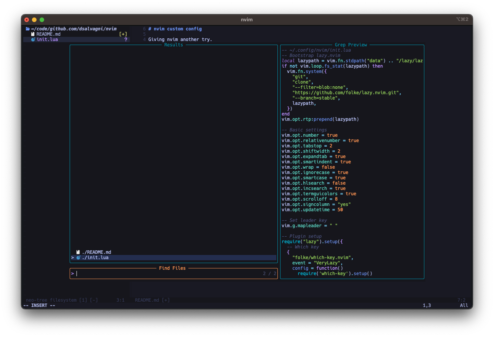
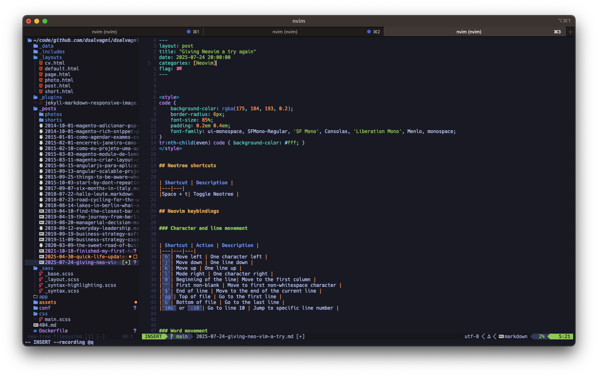
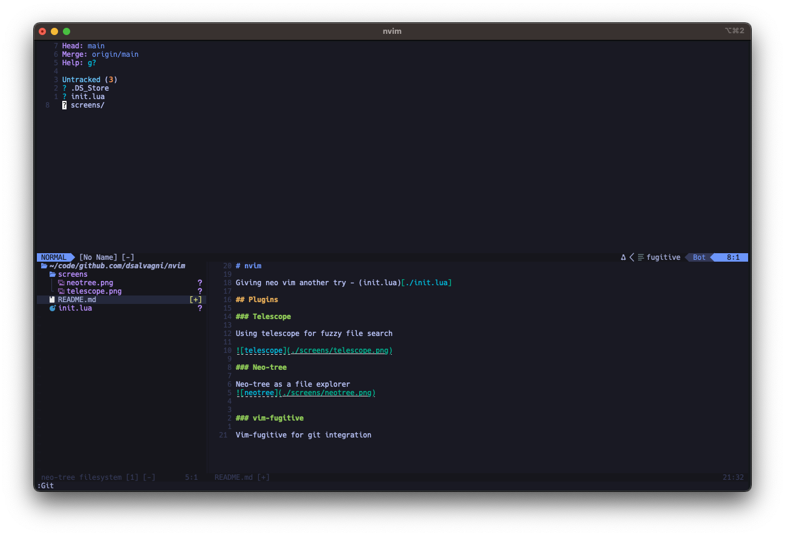

# nvim

Giving neo vim another try - (init.lua)[./init.lua]

## Plugins

### Telescope

Using telescope for fuzzy file search 

### Neo-tree

Neo-tree as a file explorer

### vim-fugitive

Vim-fugitive for git integration

### nvim-lspconfig

LSP for ruby, html, css, typescript and javascript 

### nvm-cmp

Plugin for autocompletion

### nvim-treesitter

Plugin for better syntax highlighting 

### nvm-autopairs

Plugin to math pairs e.g `()`, `[]`, `{}` etc..

### vim-rails and vim-ruby

Plugins for RoR development

#### others

* lualine for status line
* comment.nvim for comment toggling

